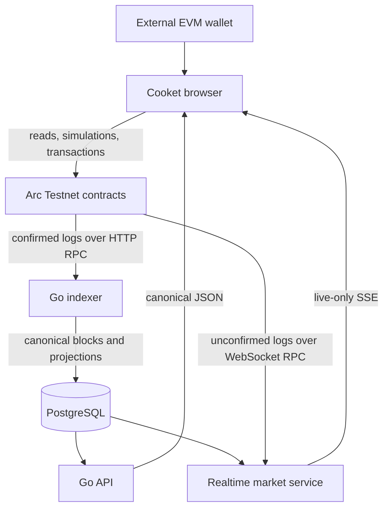

The browser is the only user transaction initiator. Contracts enforce supply, curve, fees, graduation, custody, CTO, and rewards behavior. The indexer consumes confirmed logs, detects canonical-chain changes, and writes raw provenance plus derived projections atomically. PostgreSQL is the API's read source and the realtime service's market registry.

The realtime service does not write to PostgreSQL. It watches registered curve and canonical pool addresses and broadcasts provisional market events. Canonical API results eventually replace that overlay.

Redis is configured alongside API/indexer deployments, but the current public API data path documented here is PostgreSQL-backed. Compose supports local and split production-style service layouts; it is configuration evidence, not production-health evidence.
