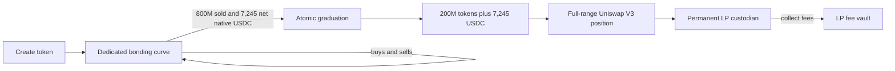

Every token follows the same contract-defined lifecycle.

1. `CooketFactoryV3` deploys the token and its curve, registers canonical relationships, and reserves the token's Uniswap V3 pool.
2. The curve initially owns all 1 billion tokens. Up to 800 million are sold on the curve; 200 million remain for liquidity.
3. Curve trades charge 1%. Buy fees are removed before reserve accounting; sell fees are removed from the gross curve output.
4. When the active reserve reaches exactly 7,245 native USDC, the curve closes and forwards the 200 million tokens and reserve principal to the graduation system.
5. Graduation converts 18-decimal native USDC to 6-decimal canonical ERC-20 USDC and mints a full-range, 1% fee-tier Uniswap V3 position directly to an ownerless per-token custodian.
6. The web terminal switches graduated tokens to canonical ERC-20 USDC swaps through the configured SwapRouter.

The indexer confirms chain events into PostgreSQL. The API serves canonical projections. The realtime service adds provisional SSE events; the browser removes them only after the relevant canonical API surfaces have indexed through the event block.
