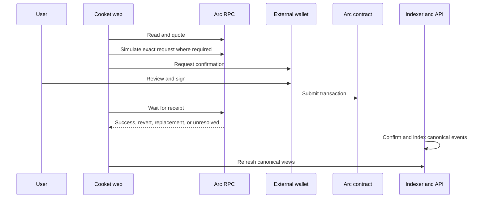

Cooket verifies the active signer and Arc Testnet chain immediately before submission. Submitted curve trades retain sender, nonce, target, value, calldata, and a bounded scan position for receipt recovery. If the original hash is missing but the nonce was consumed, recovery scans for a repriced, replaced, or cancelled transaction. If provenance remains unavailable, confirmation stays unknown.

Do not duplicate a transaction merely because the interface timed out. Inspect the original hash and nonce on [ArcScan](https://testnet.arcscan.app), then use the app's recovery path.

API and chart changes can lag a successful receipt because the indexer waits for configured confirmations. That delay does not change the chain result.
